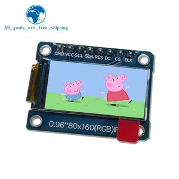
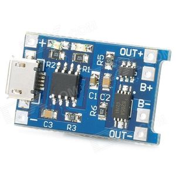
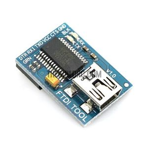
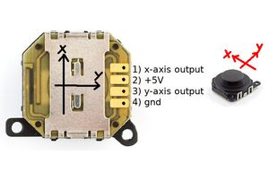
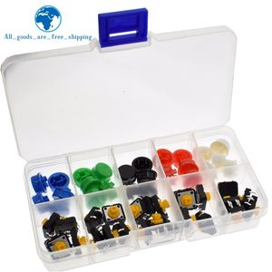

# Arduino_mini_lab

## Components

| picture | decription |
| ---- | ---- |
|  | Small 80x160 OLED display with a ST7735 driver |
|  | TP4056 based LiIon battery charger. The battery charger may need to be modified depending on the capacity of the battery used. The battery charger is located just under de display |
|  | A little board with an FTDI232, no more to say |
| | A mini joystick. Choosen for its size, not its performances. |
|  | Push buttons, the type does not really matter |

## Modification of the battery charger
By default this board is usually configured to generate a 1A current which can be too high for small batteries.
To do so, a resistor need to be changed. The resistor is R3 on the picture, connected between pin2 of TP4056 and GND.


The value for the resistor can be computed using the following formula:
```
     1200
R3 = -----      with I charging current in A
       I
```

For example:

| R3 | Current |
| -- | -- |
| 1200Ohms | 1A |
| 2400Ohms | 0.5A |

## Sidenotes
The joystick is not that reliable it should be replaced with a more robust one.
At startup, there is a calibration phase during which the value of the joystick is sampled in order to determine a rest value for both axis. After the calibration period, if you move the joystick it never returns to the rest value.

