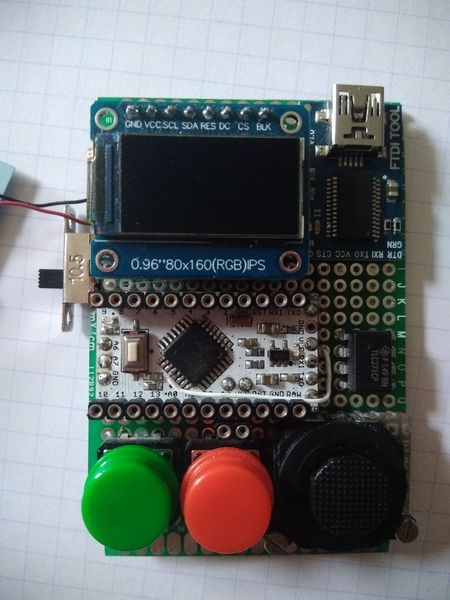

# Arduino_mini_lab

## What it is
Small development/testing platform using components that were in my drawers.
There is an Arduino mini pro, an 80x160 TFT display some buttons, a joystick, a battery charger and an FTDI tool

I have written a small library in order to have a little GUI for rapid prototyping.

I have added to UTFT a few method to init the display, read the buttons and the joystick, display battery state

## Hardware
Schematic of the board is located in [the Doc directory](Doc/miniArduino.pdf)

You can find information on hardware used [here](Hardware.md)

## Software details
In the Examples directory there are some program that demonstrate what the plateform can do.

| Name | Comment |
| :--- | :------ |
| Test_miniArduino.ino | A test software that only uses UTFT library it was used to test the board before the library was created |
| Test_Arduino_mini_lab.ino | demonstrates much of what can be done with the library |

## Library
You can find information concerning the library [here](Software.md)
