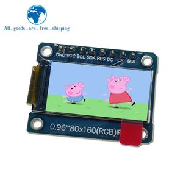
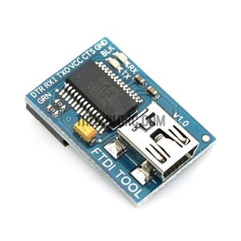
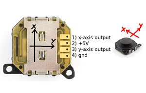
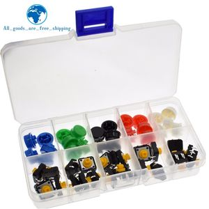

# Arduino_mini_lab

## What it is
Small development/test platform using of the shelves items that were lying in my desk.
There is an Arduino mini pro, an 80x160 TFT display some buttons, a joystick, a battery charger and an FTDI tool

I have written a small library that inherit from UTFT in order to have a little GUI for rapid prototyping.
I have added to UTFT a few method to init the display, read the buttons and the joystick, display battery state

## Components






The battery charger may need to be modified depending on the capacity of the battery used.
By default this board is configured to generate a 1A current which can be to high for small batteries.
To do so, a resistor need to be changed. The resistor is R3 on the second picture. The value of the resistor can be computed using the following formula:
R3 = 1200/I
I is charging current in A
1200Ohms for 1A
2400Ohms for 0.5A

## Software details
Test_miniArduino is a test software that only uses UTFT library it was used to test the board before the library was created.
Test_Arduino_mini_lab demonstrates what the library can do.

## Library
A structure is defined to handle joystick information
Some methods are added to UTFT existing ones. Their the names are self explanatory and the code is commented.

```
struct joystick{
    uint16_t    raw;        // raw returned by analogRead()
    int16_t     centered;   // signed value -255 <--> 255, 0 = rest position
    uint16_t    center;     // value when joystick in rest position
    bool        up;         // when value > 255
    bool        down;       // when value < 255
};


class MiniArduino : public UTFT {
    public:
        MiniArduino(void);
        
        void begin(void);
        void setInternalRefValue(uint16_t ref);
        uint32_t getBattery(void);
        void calibrateJoystick(void);
        void refreshJoysticks(void);
        bool buttonState(uint8_t button);
        void setBacklight(uint8_t level);
        uint8_t getBacklight(void);
        void drawBatteryState(uint8_t pos, uint8_t line, bool orientation);
        struct joystick    XAxis, YAxis;
```

## Sidenotes
The joystick is not that reliable it should be replaced with a more robust one.
At startup, there is a calibration phase during which the value of the joystick is sampled in order to determine a rest value for both axis. After the calibration period, if you move the joystick it never returns to the rest value.

